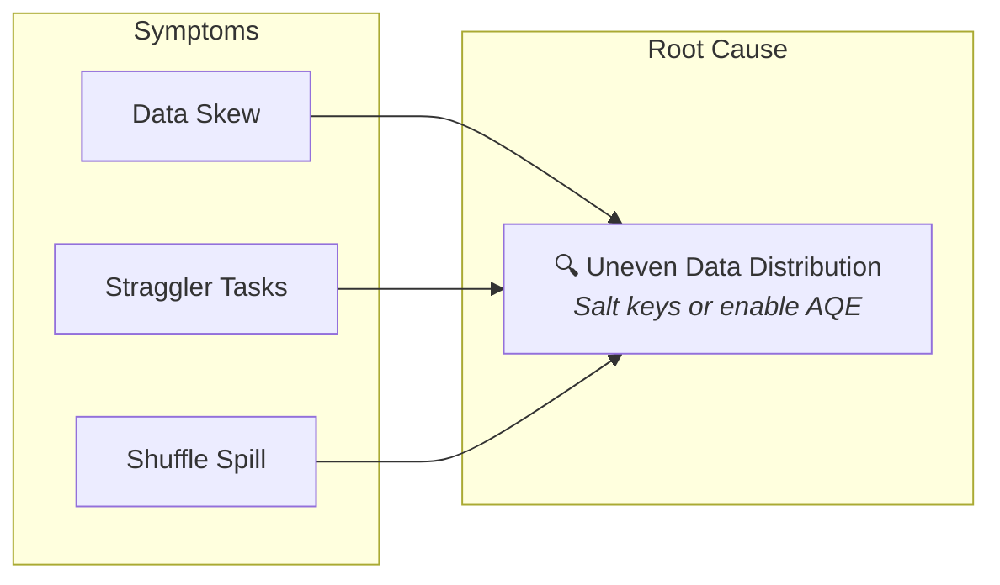
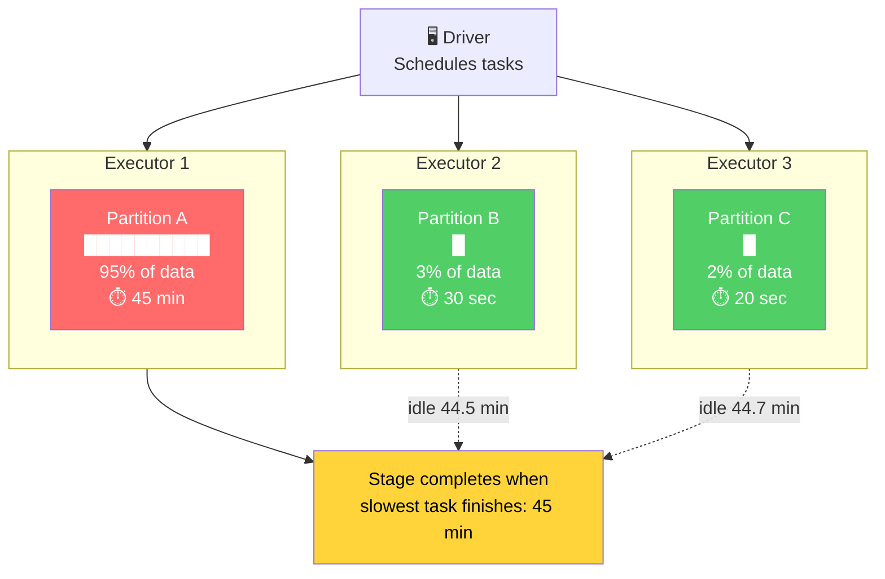
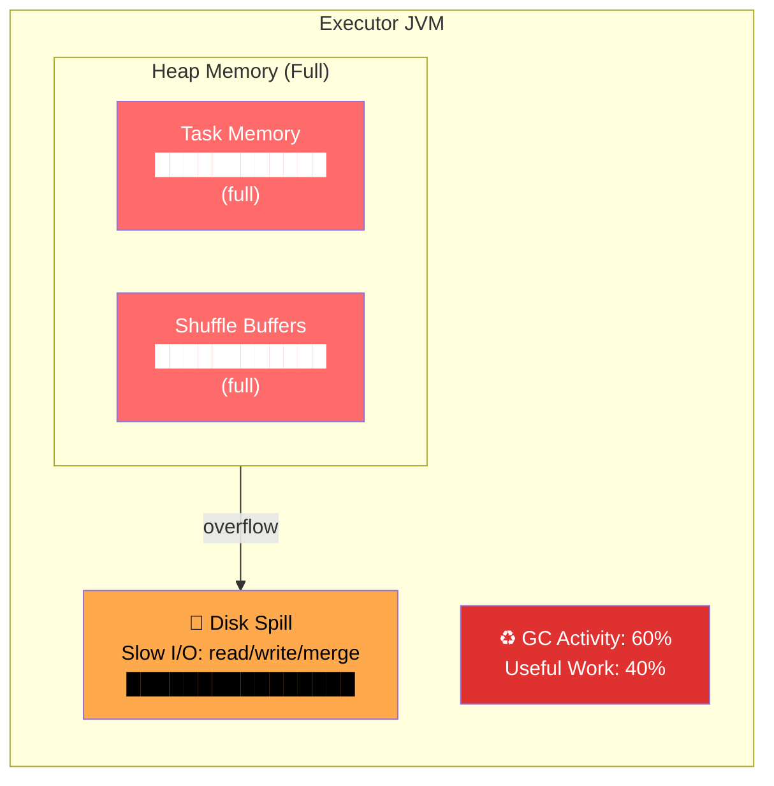
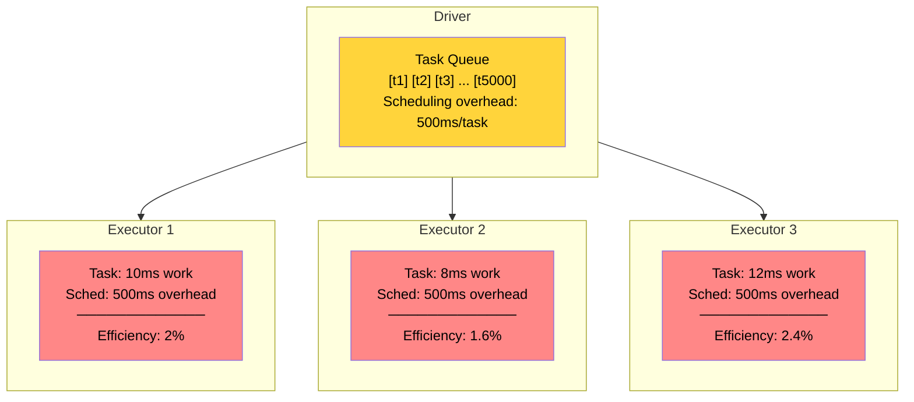
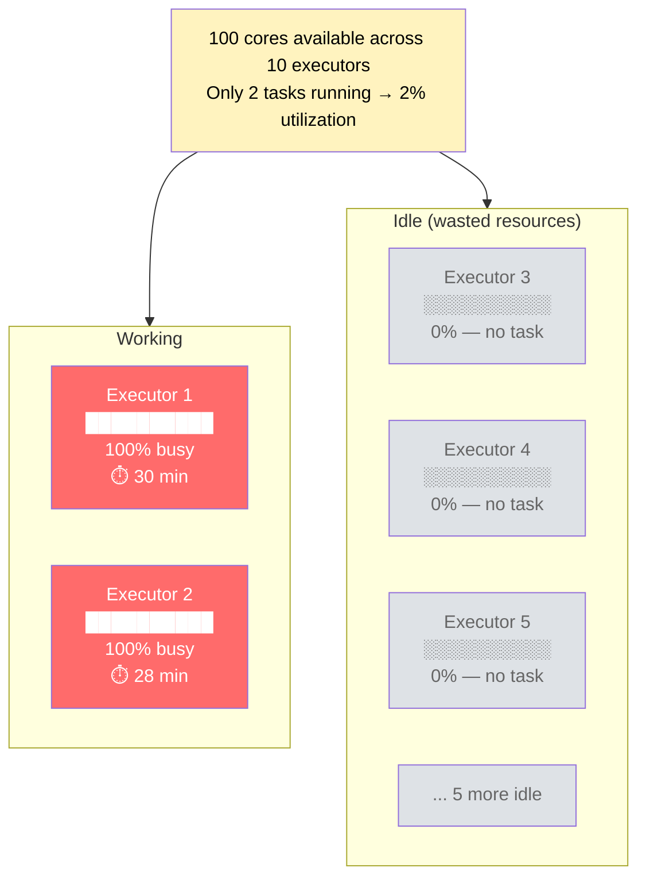
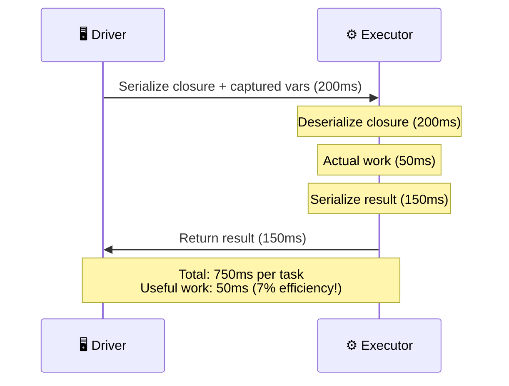
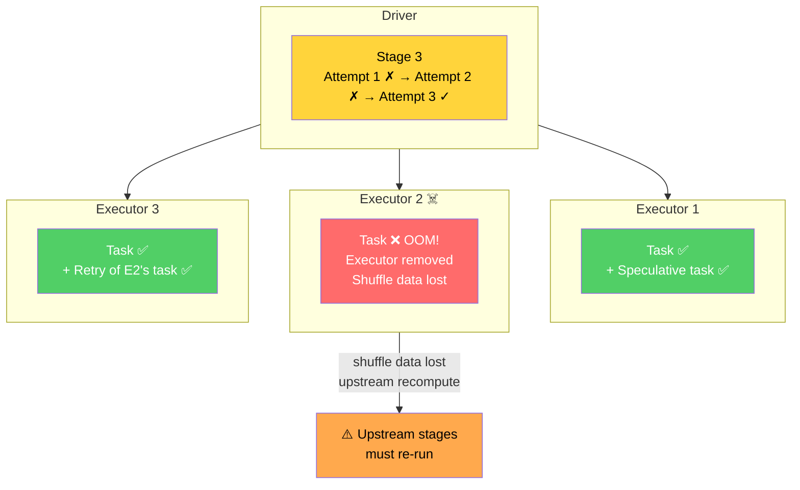
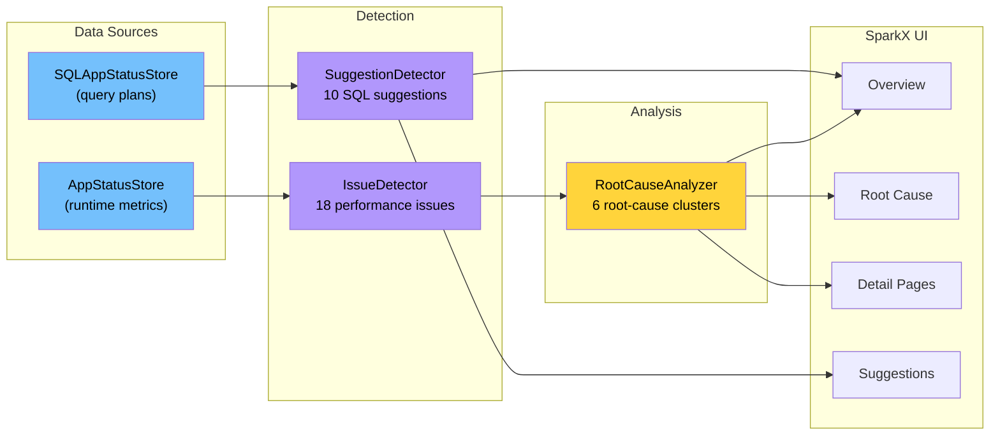

# SparkX Root Cause Analysis
### Understanding Performance Problems in Apache Spark

---

## How SparkX Root Cause Analysis Works

SparkX groups **co-occurring symptoms** into unified **root-cause clusters**.

Instead of showing 5 separate warnings, SparkX identifies the underlying problem
and provides a single actionable recommendation.



**Savings are aggregated conservatively** — `max` within a cluster to avoid double-counting.

---

## Root Cause 1: Uneven Data Distribution

### What Happens

A small number of keys hold most of the data. When Spark shuffles by these keys,
one or two partitions become massive while the rest are tiny.

### Architecture Diagram



### How It Manifests in Spark Stages

| Metric | Healthy Stage | Skewed Stage |
|--------|--------------|--------------|
| Max task duration | ~2× median | **10–1000× median** |
| Task duration distribution | Uniform | One extreme outlier |
| Shuffle write per task | Even across tasks | One task writes 90%+ |
| Spill to disk | None | Largest task spills heavily |
| GC time | Low | Largest task has high GC |

**SparkX detects**: Data Skew + Straggler Tasks + Shuffle Spill + GC Pressure

### Mitigation Strategies

**1. Salt the skewed key**
```scala
// Before: all "hot_key" rows go to one partition
df.groupBy("key").agg(sum("value"))

// After: spread hot key across N sub-partitions
val salted = df.withColumn("salt", concat($"key", lit("_"), (rand() * 10).cast("int")))
salted.groupBy("salt").agg(sum("value"))
  .withColumn("key", split($"salt", "_")(0))
  .groupBy("key").agg(sum("sum(value)"))
```

**2. Enable AQE Skew Join** (recommended for Spark 3.2+)
```
spark.sql.adaptive.enabled = true
spark.sql.adaptive.skewJoin.enabled = true
spark.sql.adaptive.skewJoin.skewedPartitionThresholdInBytes = 256MB
```

**3. Repartition by a more uniform column**
```scala
df.repartition(200, $"uniform_column").groupBy("key").agg(...)
```

---

## Root Cause 2: Memory Pressure

### What Happens

Executors don't have enough heap to hold shuffle buffers and working data in memory.
Data spills to disk, and GC cycles consume CPU time instead of doing useful work.

### Architecture Diagram



### How It Manifests in Spark Stages

| Metric | Healthy Stage | Memory-Pressured Stage |
|--------|--------------|----------------------|
| GC time / run time | < 5% | **> 10–30%** |
| Disk spill (bytes) | 0 | **GBs of spill** |
| Shuffle read from disk | 0 | Significant disk reads |
| Task duration variance | Low | High (GC pauses) |
| Executor failures | None | Possible OOM kills |

**SparkX detects**: GC Pressure + Shuffle Spill + Disk Shuffle Read + Large Broadcast

### Mitigation Strategies

**1. Increase executor memory**
```
spark.executor.memory = 8g          # was 4g
spark.executor.memoryOverhead = 2g  # off-heap buffer
spark.memory.fraction = 0.7         # more memory for execution
```

**2. Reduce per-partition data size**
```scala
// More partitions = smaller per-task memory footprint
df.repartition(400)  // was 200
```

**3. Filter earlier in the pipeline**
```scala
// Before: filter after expensive join
val result = big.join(small, "key").filter($"date" > "2024-01-01")

// After: filter before join — less data to shuffle and hold in memory
val result = big.filter($"date" > "2024-01-01").join(small, "key")
```

**4. Tune GC**
```
spark.executor.extraJavaOptions = -XX:+UseG1GC -XX:InitiatingHeapOccupancyPercent=35
```

---

## Root Cause 3: Over-partitioned Workload

### What Happens

Too many small partitions create thousands of tiny tasks. Each task has scheduling
overhead (launch, serialize closure, report result) that dominates actual work time.

### Architecture Diagram



### How It Manifests in Spark Stages

| Metric | Healthy Stage | Over-partitioned Stage |
|--------|--------------|----------------------|
| Number of tasks | ~cores × 2–4 | **5,000–50,000+** |
| Median task duration | > 1 second | **< 200ms** |
| Scheduler delay (P95) | < 50ms | **> 500ms** |
| Scheduler delay / task time | < 10% | **> 50%** |
| Total stage time | Reasonable | Inflated by scheduling |

**SparkX detects**: Small Tasks (Over-partitioned) + High Scheduler Delay

### Mitigation Strategies

**1. Coalesce partitions**
```scala
// Reduce 5000 partitions to 200 (no shuffle!)
df.coalesce(200).write.parquet("output")
```

**2. Increase partition size for file-based reads**
```
spark.sql.files.maxPartitionBytes = 256MB  # was 128MB
```

**3. Use AQE to auto-coalesce**
```
spark.sql.adaptive.enabled = true
spark.sql.adaptive.coalescePartitions.enabled = true
spark.sql.adaptive.advisoryPartitionSizeInBytes = 128MB
```

---

## Root Cause 4: Under-parallelized Workload

### What Happens

Too few partitions leave most CPU cores idle. A few executors do all the work
while the rest sit idle, and individual tasks become very large and slow.

### Architecture Diagram



### How It Manifests in Spark Stages

| Metric | Healthy Stage | Under-parallelized Stage |
|--------|--------------|------------------------|
| Number of tasks | ~cores | **< cores × 0.5** |
| CPU utilization | > 80% | **< 50%** |
| Task duration | Seconds | **Minutes to hours** |
| Executor idle time | Low | Most executors idle |
| Shuffle spill | None | Possible (large partitions) |

**SparkX detects**: Under-partitioned Stage + Low CPU Utilization + Straggler Tasks

### Mitigation Strategies

**1. Increase partition count**
```scala
// Force more partitions
df.repartition(200)  // was 2
```

**2. Tune shuffle partitions**
```
spark.sql.shuffle.partitions = 200    # match core count
spark.default.parallelism = 200
```

**3. Enable AQE (for shuffle stages)**
```
spark.sql.adaptive.enabled = true
```

---

## Root Cause 5: Serialization Overhead

### What Happens

Tasks spend excessive time serializing/deserializing closures, data, and results.
This happens when using Java serialization (slow), capturing large driver objects
in closures, or returning large results from tasks.

### Architecture Diagram



### How It Manifests in Spark Stages

| Metric | Healthy Stage | Serialization-Heavy Stage |
|--------|--------------|--------------------------|
| Task deserialization (P95) | < 50ms | **> 200ms** |
| Result serialization (P95) | < 20ms | **> 200ms** |
| Result size (P95) | < 1 MB | **> 50 MB** |
| Useful work / total time | > 90% | **< 50%** |
| Serializer type | Kryo | **Java (default)** |

**SparkX detects**: High Task Deserialization + Large Task Result + Slow Result Serialization

### Mitigation Strategies

**1. Switch to Kryo serialization** (10× faster than Java serialization)
```
spark.serializer = org.apache.spark.serializer.KryoSerializer
spark.kryo.classesToRegister = com.example.MyClass,com.example.Other
spark.kryo.registrationRequired = false
```

**2. Avoid capturing large objects in closures**
```scala
// BAD: captures entire `lookupMap` (100 MB) in every task's closure
val lookupMap = loadHugeLookup()  // on driver
rdd.map(row => lookupMap(row.key))

// GOOD: broadcast it once, reference in tasks
val bcLookup = spark.sparkContext.broadcast(lookupMap)
rdd.map(row => bcLookup.value(row.key))
```

**3. Avoid collecting large results**
```scala
// BAD: serializes entire dataset to driver
val all = df.collect()

// GOOD: write to storage
df.write.parquet("output/path")
```

---

## Root Cause 6: Node / Executor Instability

### What Happens

Executors crash (OOM, disk full, hardware failure) causing task failures and stage
retries. Spark re-executes failed tasks on other nodes, wasting compute. Speculation
may launch duplicate tasks, consuming additional resources.

### Architecture Diagram



### How It Manifests in Spark Stages

| Metric | Healthy Stage | Unstable Stage |
|--------|--------------|----------------|
| Failed tasks | 0 | **> 0** |
| Stage attempts | 1 | **2–4** (retries) |
| Speculative tasks | 0 | **Multiple** |
| Executor removals | 0 | **1+** |
| Stage wall-clock time | Expected | **2–4× expected** (retries) |

**SparkX detects**: Task Failures + Speculative Tasks + Stage Retry

### Mitigation Strategies

**1. Increase memory headroom**
```
spark.executor.memory = 8g
spark.executor.memoryOverhead = 2g       # off-heap (container overhead)
spark.memory.fraction = 0.6              # leave more room for user objects
```

**2. Enable external shuffle service** (survive executor loss)
```
spark.shuffle.service.enabled = true     # shuffle data persists after executor death
spark.dynamicAllocation.enabled = true   # replace failed executors
```

**3. Tune speculation** (duplicate slow tasks, not failed ones)
```
spark.speculation = true
spark.speculation.quantile = 0.9         # speculate when 90% of tasks done
spark.speculation.multiplier = 1.5       # speculate if 1.5× slower than median
```

**4. Investigate logs**
```bash
# Find OOM in executor logs
yarn logs -applicationId <app_id> | grep -i "OutOfMemoryError"

# Check for disk full
yarn logs -applicationId <app_id> | grep -i "No space left"
```

---

## Summary: Detection → Root Cause → Action



| Root Cause | Primary Signal | Key Fix | Config Tuning |
|------------|---------------|---------|---------------|
| **Uneven Data Distribution** | Skew ratio > 3× | Salt keys or AQE skew join | `spark.sql.adaptive.skewJoin.enabled` |
| **Memory Pressure** | GC > 10% | More memory, fewer partitions | `spark.executor.memory` |
| **Over-partitioned** | Median task < 200ms | `coalesce()` or AQE | `spark.sql.adaptive.coalescePartitions` |
| **Under-parallelized** | Tasks < cores × 0.5 | `repartition()` | `spark.sql.shuffle.partitions` |
| **Serialization Overhead** | Deser > 200ms P95 | Kryo serializer | `spark.serializer` |
| **Node Instability** | Failed tasks > 0 | External shuffle + more memory | `spark.shuffle.service.enabled` |

---

*Generated by SparkX — Advanced Spark UI Extension*
